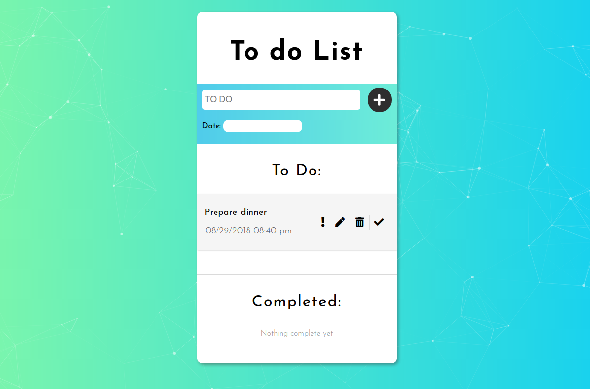

# ToDo-v1
ToDo-v1 is an app supporting tasks management. To remeber about important things you can easily create, modify and delte a task with a specific deadline. Additionally, each task might by marked as prioritized. Completed tasks are moved to `Completed` section. 

 

## Credentials

ToDo-v1 web project was designed and implemented during Fronted course in CodersLab by:
1. Dominika Dziubińska  (https://github.com/kostkaczekolady)
2. Karol Kałtus  (https://github.com/karolkalkus)
3. Michał Ostrożny  (https://github.com/mostrozny)
4. Mikołaj Schatt  (https://github.com/r1skz3ro)

## Installation

1. Clone the repository: `git clone https://github.com/kostkaczekolady/ToDo-v1.git`
2. Install the application: `npm install`
3. Enjoy!

[demo] (https://kostkaczekolady.github.io/ToDo-v1/)

